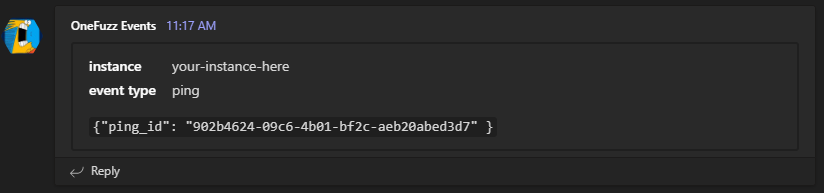

# Webhooks Endpoint Example

This example endpoint takes any incoming [OneFuzz webhook](../../docs/webhooks.md) and submits it to Microsoft Teams.  

Check out [Webhook Events Details](../../docs/webhook_events.md) for the schema of all supported events.

## Creating an Azure Function

1. Edit `local.settings.json` and add the following to the `Values` dictionary:
    * Create a [Microsoft Teams incoming webhook URL](https://docs.microsoft.com/en-us/microsoftteams/platform/webhooks-and-connectors/how-to/connectors-using#setting-up-a-custom-incoming-webhook), and set this the value for `TEAMS_URL`.
    * Create a random string that you generate, and set this value for `HMAC_TOKEN`.  This will be used to [help secure your webhook](https://github.com/microsoft/onefuzz/blob/main/docs/webhooks.md#securing-your-webhook)
2. [Create Azure Resources for an Azure Function](https://docs.microsoft.com/en-us/azure/azure-functions/create-first-function-cli-python?tabs=azure-cli%2Cbash%2Cbrowser#5-create-supporting-azure-resources-for-your-function).
3. Ensure your function is HTTPS only:
    ```bash
    az functionapp update --resource-group <RESOURCE_GROUP> --name <FUNCTION_APP_NAME> --set httpsOnly=true
    ```
4. Deploy your function
    ```bash
    func azure functionapp publish <FUNCTION_APP_NAME> --publish-local-settings
    ```
5. From the previous command, write down the URL for your webhook.  It should look something like this:
    ```
    webhook - [httpTrigger]
        Invoke url: https://<FUNCTION_APP_NAME>.azurewebsites.net/api/webhook?code=<BASE64_ENCODED_STRING>
    ```
6. Register this new URL webhook to OneFuzz.  In this example, we're registering a webhook to tell our service any time a job is created and stopped:
    ```bash
    onefuzz webhooks create my-webhook "https://<FUNCTION_APP_NAME>.azurewebsites.net/api/webhook?code=<BASE64_ENCODED_STRING>" job_created job_stopped --secret_token <HMAC_TOKEN>
    ```

    > NOTE: Make sure `HMAC_TOKEN` is the value we added to `local.settings.json` earlier.

    This will respond with something akin to:
    ```json
    {
        "event_types": [
            "job_created",
            "job_stopped"
        ],
        "name": "my-webhook",
        "webhook_id": "9db7a8bb-0680-42a9-b336-655d3654fd6c"
    }
    ```
7. Using the `webhook_id` we got in response, we can test our webhook using:
    ```bash
    onefuzz webhooks ping 9db7a8bb-0680-42a9-b336-655d3654fd6c
    ```
8. Using `webhook_id` we got in response, we can test if OneFuzz was able to send our service webhooks:
    ```
    onefuzz webhooks logs 9db7a8bb-0680-42a9-b336-655d3654fd6c
    ```

    If our webhook is successful, we'll see something akin to:
    ```json
    [
        {
            "event": {
                "ping_id": "0770679d-67a0-4a6e-a5d7-751c7f80ebab"
            },
            "event_id": "0c12ca77-bff8-4f8b-ae0d-f38f64cf0247",
            "event_type": "ping",
            "instance_id": "833bd437-775c-4b80-be62-599a9907f0f9",
            "instance_name": "YOUR-ONEFUZZ-INSTANCE-NAME",
            "state": "succeeded",
            "try_count": 1,
            "webhook_id": "9db7a8bb-0680-42a9-b336-655d3654fd6c"
        }
    ]
    ```
   
    OneFuzz will attempt to send each event up to 5 times before giving up.  Instead of `succeeded` as above, you might see `retrying` if OneFuzz is still working to send the event, or `failed` if OneFuzz has given up sending the event.
9. Check your Teams channel.  If all is successful, we should see something like the following:
    

## Troubleshooting

*  If your function isn't working as expected, check out the logs for your Azure Functions via:
    ```
    func azure functionapp logstream <FUNCTION_APP_NAME> --browser
    ```
* If you see exceptions that say `missing HMAC_TOKEN` or `missing TEAMS_URL`, you forgot to add those settings above. 
* If you see exceptions saying `missing X-Onefuzz-Digest`, you forgot to set the `--secret_token` when you during `onefuzz webhooks create` above.  This can be addressed via:
    ```
    onefuzz webhooks update --secret_token <HMAC_TOKEN> <webhook_id>
    ```
