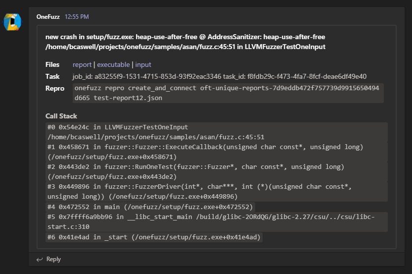

# Notifications via Microsoft Teams

OneFuzz can send notifications to [Microsoft Teams](https://docs.microsoft.com/en-us/microsoftteams/) channels upon new file creation within OneFuzz managed [containers](../containers.md).

## Notifications

Upon creation of new crash reports (see [onefuzztypes.models.Report](../../src/pytypes/onefuzztypes/models.py))
in monitored containers, a detailed notification including crash details and download
links to the report, executable, and crashing input.

Upon creation of any other file, a trimmed down notification is created with the name
of the file with a download link.

For this purpose, most users will want to monitor `reports` or `unique_reports` rather than `crashes` containers.

## Integration

1. Create an [incoming webhook in Teams](https://docs.microsoft.com/en-us/microsoftteams/platform/webhooks-and-connectors/how-to/connectors-using#setting-up-a-custom-incoming-webhook).
1. Add a notification to your OneFuzz instance.

    ```
    onefuzz notifications create <CONTAINER> @./config.json
    ```

Until the integration is deleted, when a crash report is written to the indicated container, the webhook will be used to send notification of the crash.

## Example Config

```json
{
    "config": {
        "url": "<INCOMING_WEBHOOK_HERE>",
    }
}
```

## Screenshot

