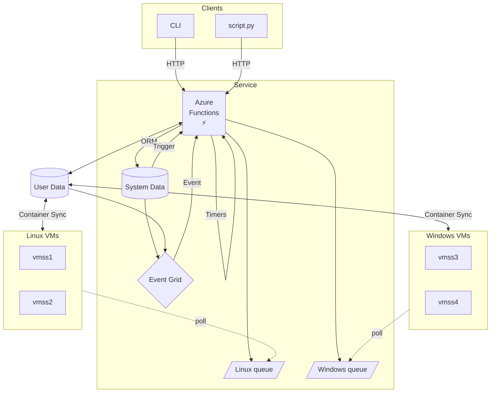

## Architecture Overview

```mermaid
flowchart TB

  subgraph clients[Clients]
    CLI
    script.py
  end

  subgraph service[Service]
    AzFunc("Azure\nFunctions\n⚡")

    pool-linux[/Linux queue/]
    pool-win[/Windows queue/]
    
    EventGrid{Event Grid}
    SystemData[(System Data)]  
  end
  
  UserData[(User Data)]

  subgraph linux-compute[Linux VMs]
    vmss1
    vmss2
  end

  subgraph windows-compute[Windows VMs]
    vmss3
    vmss4
  end
  
  CLI--HTTP-->AzFunc
  script.py--HTTP-->AzFunc

  AzFunc--Timers-->AzFunc
  AzFunc --> pool-linux
  AzFunc --> pool-win
  AzFunc <--> UserData
  AzFunc -- ORM --> SystemData
  SystemData -- Trigger --> AzFunc

  SystemData --> EventGrid
  UserData --> EventGrid
  EventGrid -- Event --> AzFunc

  UserData <-- Container Sync --> linux-compute
  UserData <-- Container Sync --> windows-compute
  
  linux-compute -. poll .-> pool-linux
  windows-compute -. poll .-> pool-win
```
