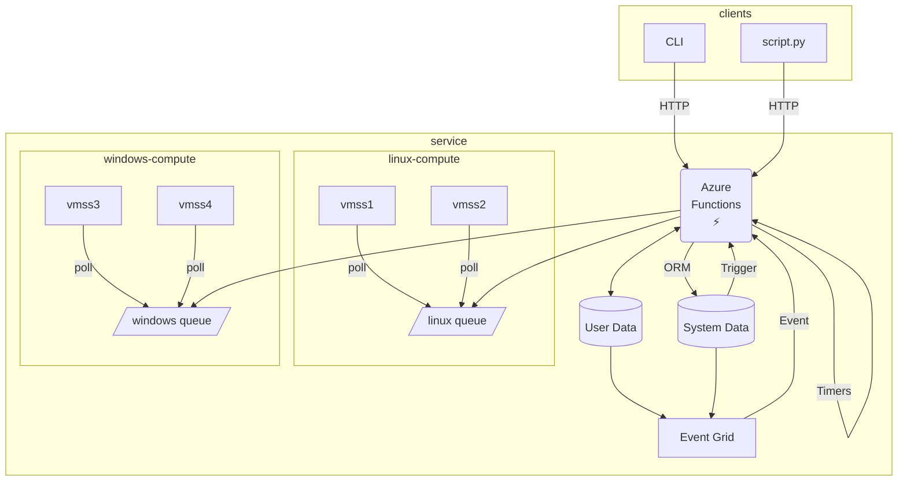

## Overview

```mermaid
flowchart TB

subgraph clients
  CLI
  script.py
end

subgraph service
  AzFunc("Azure\nFunctions\n⚡")

  UserData[(User Data)]
  EventGrid[Event Grid]
  SystemData[(System Data)]

  subgraph linux-compute
    pool-linux[/linux queue/]
    vmss1 -- poll --> pool-linux
    vmss2 -- poll --> pool-linux
    vmss1
    vmss2
  end
  
  subgraph windows-compute
    pool-win[/windows queue/]
    vmss3 -- poll --> pool-win
    vmss4 -- poll --> pool-win
    vmss3
    vmss4
  end
end

CLI--HTTP-->AzFunc
script.py--HTTP-->AzFunc

AzFunc--Timers-->AzFunc
AzFunc --> pool-linux
AzFunc --> pool-win
AzFunc <--> UserData
AzFunc -- ORM --> SystemData
SystemData -- Trigger --> AzFunc

UserData --> EventGrid
SystemData --> EventGrid
EventGrid -- Event --> AzFunc
```
